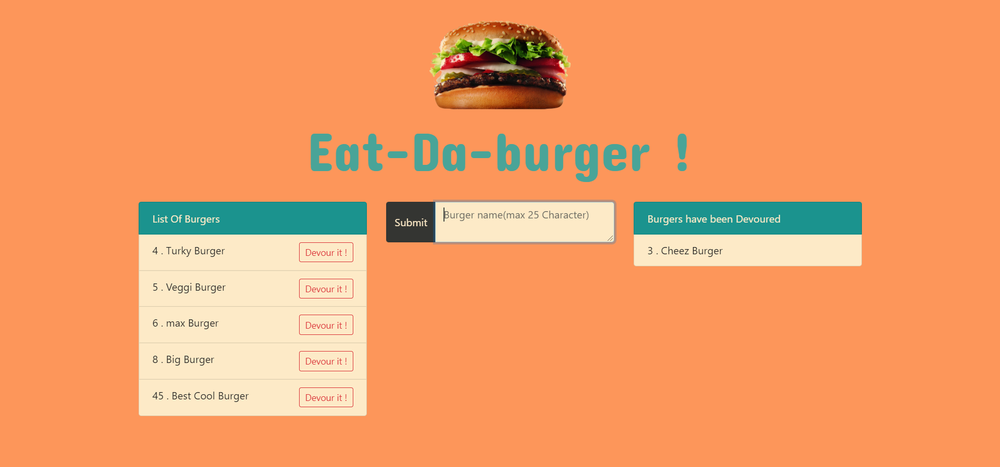

# Eat-Da-Burger

* Eat-Da-Burger is a burger logger app  with MySQL, Node, Express, Handlebars and a homemade ORM .

* This app is a restaurant app that lets users input the names of burgers they'd like to eat.

* Whenever a user submits a burger's name, the app will display the burger on the left side of the page -- waiting to be devoured.

* Each burger in the waiting area also has a `Devour it!` button. When the user clicks it, the burger will move to the right side of the page.

* This app will store every burger in a database, whether devoured or not.


#### Directory for this app


```
.
├── config
│   ├── connection.js
│   └── orm.js
│ 
├── controllers
│   └── burgers_controller.js
│
├── db
│   ├── schema.sql
│   └── seeds.sql
│
├── models
│   └── burger.js
│ 
├── node_modules
│ 
├── package.json
│
├── public
│   └── assets
│       ├── css
│       │   └── burger_style.css
│       └── img
│           └── burger.png
│   
│
├── server.js
│
└── views
    ├── index.handlebars
    └── layouts
        └── main.handlebars
```

## How to run this application :

* npm run start (node server.js).

* npm run dev (nodemon server.js).


#### How this application looks like ?





## Live Link
[Heroku](https://arvin-burger-shack.herokuapp.com/)